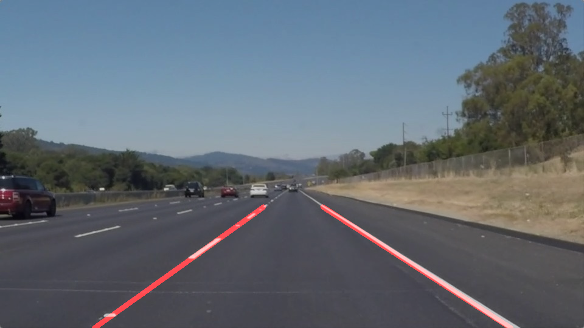

# **Finding Lane Lines on the Road** 

## Writeup Template

### You can use this file as a template for your writeup if you want to submit it as a markdown file. But feel free to use some other method and submit a pdf if you prefer.

---

**Finding Lane Lines on the Road**

The goals / steps of this project are the following:
* Make a pipeline that finds lane lines on the road
* Reflect on your work in a written report

[//]: # (Image References)

[image1]: ./examples/grayscale.jpg "Grayscale"

---

### Reflection

### 1. Describe your pipeline. As part of the description, explain how you modified the draw_lines() function.

My pipeline consisted of 5 steps. 
Step 1: Initially I did exactly as in the lecture. Converted the image to grayscale

Step 2: Passed the grayscale image through a Gaussian filter to remove noise.
Step 3: The filtered Image is then presented to Canny Edge detector.

Step 4: Next I identified a region of interest in the image. Masked it. 
Step 5: And lastly applied Hough Transform to find the lines only in the region of interest. 

These steps worked fine on the stationary images and the first video where the lanes were of white color.

But the lines were broken and too many. So I worked on the draw_lines2 function. I made the following changes:
* First separated the lines detected by Hough Transform into left lane or right lane based on slope. Also removed extreme horizintal or vertical lines by using the slope parameter slope = (y2-y1)/(x2-x1)

* Next from the x1,y1,x2,y2 points of each line detected, I found the average slope and average center point. Using the simple equation of line, used this average to determine the top and bottom x points. (The top and bottom y-points were determined from image shape.)

* To ensure that the lines with higher votes are thicker, I also defined a quantity weight proportional to the number of points in the particular line. This weight was used to determine the thickness of the line drawn.

### 2. Identify potential shortcomings with your current pipeline

With all these changes, in the first two videos the lanes were getting discovered quite well. But not the challenge Video. As I observed the video, I found that in between there are places where due to Sunlight and Shadow, the Yellow color on road merges with the rest of the road, and my edge detector is not able to detect that little gradient. One choice was decreasing threshold, but it resulted in more noise. So I decided to make selection of Yellow and White colors within the image.

This helped in detecting the lane throughout.
Still there are few shortcomings:

1. The lanes thickness is not very accurate nor are there positioning perfect.
2. It seems that the pipeline will not be able to handle sharp curves
3. The present colour scheme will fail in dark.
4. If another car is very near, the lanes will not be detected

### 3. Suggest possible improvements to your pipeline

To be honest the possible improvements I could think of, I implemented in grayscale function (detecting yellow and white colour in image) and draw_line (drawing lines with thickness dependent on weight)

For handling sharp curves, some other form of transforms are needed.
Another potential improvement could be to extrapolate the lanes, even when the path ahead is covered by another vehicle. 
